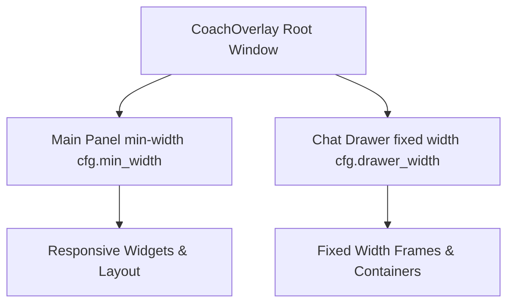

# Plan: GUI Resize Bug Fix

## Objectives
1. **Drawer/Chat Panel Fixed Width**: Ensure the chat drawer maintains its exact configured width (`cfg.drawer_width`) and cannot be sized down below it.
2. **Main Panel Invariance**: Ensure the main panel never resizes when the chat drawer is toggled open or closed.
3. **Min-Width Respect**: Ensure the main panel and window respect their minimum widths (`cfg.min_width` when closed, `cfg.min_width + cfg.drawer_width` when open) without forcing the chat panel out of view.

---

## Technical Design & Architecture

### 1. Root Window Minimum Sizing (`self.minsize`)
- In [`gui/tkinter_app.py`](gui/tkinter_app.py:59), configure explicit root window minimum size (`self.minsize(...)`):
  - When drawer is closed: `self.minsize(cfg.min_width, cfg.min_height)`
  - When drawer is open: `self.minsize(cfg.min_width + cfg.drawer_width, cfg.min_height)`
- Update `self.minsize` dynamically whenever the drawer visibility changes in [`gui/tkinter_app.py`](gui/tkinter_app.py:578) (`_set_drawer_visible`).

### 2. Chat Drawer Width Protection
- In [`gui/chat_drawer.py`](gui/chat_drawer.py:13) (`_create_drawer_widgets`), both `drawer_outer_frame` and `drawer_frame` use `width=cfg.drawer_width` and `pack_propagate(False)`.
- Ensure parent container configuration and packing order prevent compression when resizing.

### 3. Invariant Main Panel Width on Toggle
- In [`gui/tkinter_app.py`](gui/tkinter_app.py:578) (`_set_drawer_visible`), when toggling:
  - Opening: Increase total window width by `cfg.drawer_width`, leaving main panel width untouched.
  - Closing: Decrease total window width by `cfg.drawer_width`, leaving main panel width untouched.

### 4. Main Panel Widget Responsiveness at `min_width`
- In [`gui/tkinter_app.py`](gui/tkinter_app.py:284), adjust fixed canvas widths for `eta_bar` (160) and `token_bar` (140) or make them scale dynamically so that at `cfg.min_width = 320`, the contents do not exceed the available width and force truncation or overflow.
